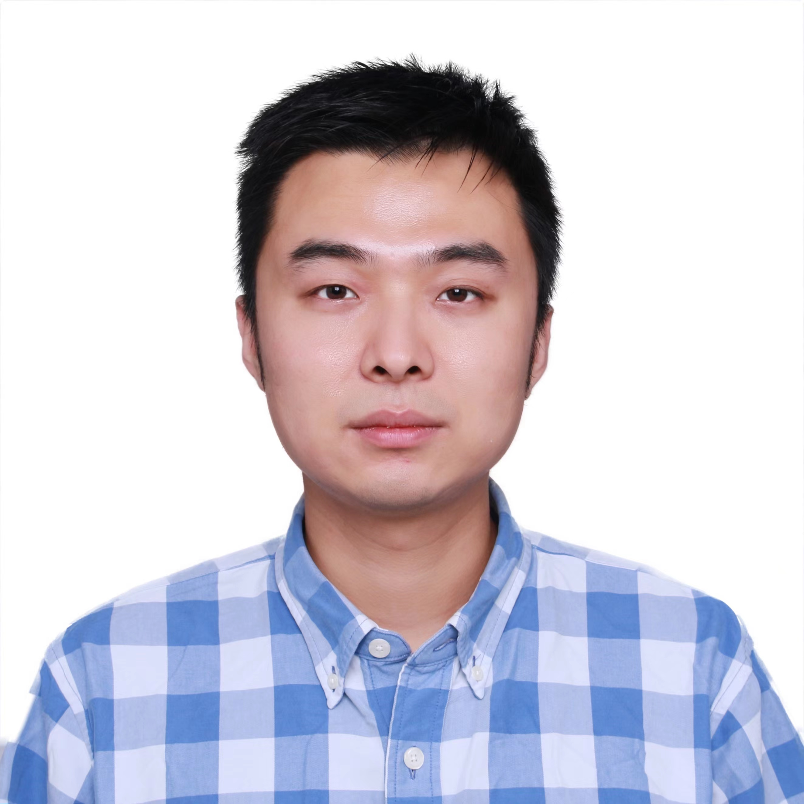

# Yuzhang Shang (尚玉章)


    
email: yshang4 [AT] hawk [DOT] iit [DOT] edu     
WeChat: 'surname' + 'given_name' in Pinyin    
address: 15 Yemen Road, Yemen    

## BIO
I am currently a Ph.D. freshman of Computer Science at the Illinois Institute of Technology (IIT), mentored by Prof. [Yan Yan](https://tomyan555.github.io/).    

Before IIT, I worked as research assistants at Shandong University and Hong Kong University of Science and Technology (HKUST) under supervision of Prof. [Liqiang Nie](https://liqiangnie.github.io/index.html) and Prof. [Dan Xu](https://www.danxurgb.net/), respectively. I received my bachelor's degrees in Mathematics and Economics (dual degrees), advised by Prof. [Xiliang Lv](https://scholar.google.com/citations?user=SIJCkXcAAAAJ&hl=en) at Wuhan University. His research focuses on **_neural network compression_** and **_multitask learning_**.    


> Motto: Wir müssen wissen, wir werden wissen!    

### Hobby
_Besides research, I was a contract photographer for Shutterstock Images and Getty Images, and here is his [portfolio](https://500px.com.cn/shang)._
    
    
## Publications 
Most recent publications on [Google Scholar](https://scholar.google.com/citations?user=6ZPL5E0AAAAJ&hl=zh-CN&citsig=AMD79oqEOpz5S5-oOv8pxWp3FtdO-RXVSQ)

### First-authored Papers

* **Network Binarization via Contrastive Learning**    
**Yuzhang Shang**, Dan Xu, Ziliang Zong, Liqiang Nie, Yan Yan  
2022 European Conference on Computer Vision (_ECCV_ 2022)  
[paper](https://arxiv.org/abs/2207.02970) [code](https://github.com/42Shawn/CMIM)

* **Lipschitz Continuity Retained Binary Neural Network**    
**Yuzhang Shang**, Dan Xu, Bin Duan, Ziliang Zong, Liqiang Nie, Yan Yan  
2022 European Conference on Computer Vision (_ECCV_ 2022)  
[paper](https://arxiv.org/abs/2207.06540) [code](https://github.com/42Shawn/LCR_BNN)

* **Win the Lottery Ticket via Fourier Analysis: Frequencies Guided Network Pruning**    
**Yuzhang Shang**, Bin Duan, Ziliang Zong, Liqiang Nie, Yan Yan  
2022 IEEE International Conference on Acoustics, Speech and Signal Processing (_ICASSP_ 2022)  
[paper](https://arxiv.org/pdf/2201.12712.pdf) 

* **Lipschitz Continuity Guided Knowledge Distillation**    
**Yuzhang Shang**, Bin Duan, Ziliang Zong, Liqiang Nie, Yan Yan  
2021 IEEE International Conference on Computer Vision (_ICCV_ 2021)    
[paper](https://openaccess.thecvf.com/content/ICCV2021/papers/Shang_Lipschitz_Continuity_Guided_Knowledge_Distillation_ICCV_2021_paper.pdf)  [code](https://github.com/42Shawn/LONDON/tree/master)    


<!-- You can use the [editor on GitHub](https://github.com/42Shawn/yuzhang-github.io/edit/gh-pages/index.md) to maintain and preview the content for your website in Markdown files.

Whenever you commit to this repository, GitHub Pages will run [Jekyll](https://jekyllrb.com/) to rebuild the pages in your site, from the content in your Markdown files.

### Markdown

Markdown is a lightweight and easy-to-use syntax for styling your writing. It includes conventions for

```markdown
Syntax highlighted code block

# Header 1
## Header 2
### Header 3

- Bulleted
- List

1. Numbered
2. List

**Bold** and _Italic_ and `Code` text

[Link](url) and 
```

For more details see [GitHub Flavored Markdown](https://guides.github.com/features/mastering-markdown/).

### Jekyll Themes

Your Pages site will use the layout and styles from the Jekyll theme you have selected in your [repository settings](https://github.com/42Shawn/yuzhang-github.io/settings/pages). The name of this theme is saved in the Jekyll `_config.yml` configuration file.

### Support or Contact

Having trouble with Pages? Check out our [documentation](https://docs.github.com/categories/github-pages-basics/) or [contact support](https://support.github.com/contact) and we’ll help you sort it out.
 -->
